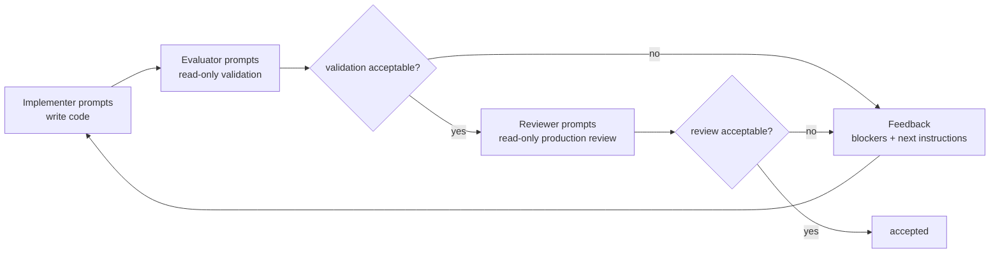

# Loopy

Loopy is a tiny prompt-driven development loop for coding agents.

The important idea is that the Python code should stay boring. The behavior lives in markdown prompt
packs:

```text
prompts/
  implementer/
  evaluator/
  reviewer/
```

Each markdown file in a role directory becomes one agent call. Add, remove, split, reorder, or tune
those prompt files to change how Loopy develops code.

## The Loop

Loopy runs this loop until the reviewer accepts the work or `--max-iters` is reached:



Before the loop starts, Loopy makes one read-only context call against the target project. That shared
project context is injected into every later implementer, evaluator, and reviewer prompt.

## Prompt Payload

Every prompt file receives the same high-level payload:

```xml
<role>reviewer</role>
<iteration>1</iteration>

<iteration_goal>
Initial implementation pass. Build the original task as completely as practical...
</iteration_goal>

<original_task>
...
</original_task>

<project_context>
...
</project_context>

<previous_review>
...
</previous_review>

<current_iteration_implementation_reports>
...
</current_iteration_implementation_reports>

<current_iteration_evaluation_reports>
...
</current_iteration_evaluation_reports>

<prompt_file name="001-review.md">
...
</prompt_file>
```

The payload makes each call stateless and repeatable. Later calls do not depend on native CLI session
memory; Loopy passes the task, context, reports, and previous blockers explicitly.

## Roles

Implementation prompts live in `prompts/implementer/`.

The implementer writes code. On the first pass it should build the original task as completely as
practical. On later passes it should focus on the previous evaluator or reviewer blockers while
preserving the original task intent. The default prompt favors TDD when applicable, codebase
conventions, simple design, and concrete validation.

Evaluator prompts live in `prompts/evaluator/`.

The evaluator is read-only. It inspects the change, decides what tests/checks are relevant, runs
them, and returns structured blocker feedback if validation fails or cannot reasonably be completed.
If evaluation fails, Loopy skips the broader reviewer for that iteration and sends the evaluator
feedback straight to the next implementer pass.

Reviewer prompts live in `prompts/reviewer/`.

The reviewer is read-only. It does the production-readiness review: correctness, cohesion with the
surrounding system, conventions, simplicity, pragmatic factoring, duplication, dead code, and
repo-grounded assumptions. Reviewer reports decide whether the loop stops.

By default, Loopy uses the prompt folders from this checkout, even when you run `loopy` from another
project directory. Use `--implementer-dir`, `--evaluator-dir`, or `--reviewer-dir` to point at a
custom prompt pack.

## Output Contract

Evaluator and reviewer calls must return JSON matching this contract:

```json
{
  "acceptable": false,
  "summary": "Short review summary.",
  "findings": [
    {
      "severity": "blocker",
      "summary": "What must be fixed.",
      "details": "Optional details.",
      "files": ["optional/path.py"]
    }
  ],
  "next_instructions": "Optional instructions for the next implementation pass."
}
```

Loopy enforces this in two ways:

- For Codex, evaluator and reviewer calls include `codex exec --output-schema <schema-file>`.
- For Claude, evaluator and reviewer calls include `claude -p --json-schema <schema-json>`.
- After the CLI returns, Loopy validates the final output with Pydantic.

Context and implementer calls do not use the structured output contract. Their outputs are saved as
plain text reports and fed into later phases as context.

## Usage

Install the local checkout as an editable user tool from this repository:

```bash
uv tool install --editable .
```

Then run Loopy from any project directory:

```bash
loopy \
  --engine codex \
  --task-file task.md \
  --max-iters 3
```

By default, `--target` is `.`, so the agents inspect and edit the directory where you run `loopy`.

You can also pass a short task inline:

```bash
loopy --engine codex --task "Add a health check endpoint."
```

To run only a read-only review of your current unstaged changes, use:

```bash
loopy review --engine codex
```

Review-only mode skips implementation and evaluation, captures the requested git diff, and runs the
reviewer once. By default it reviews unstaged tracked changes plus untracked files. You can also
review staged changes or all current changes:

```bash
loopy review --diff-scope staged
loopy review --diff-scope all
```

Pass `--task` or `--task-file` with `loopy review` when you want the reviewer to judge the diff
against specific acceptance criteria.

## Run Artifacts

Every run is saved under `runs/`, which is gitignored:

```text
runs/
  20260429-093100-add-health-check-endpoint/
    task.md
    context.md
    context.prompt.xml
    context.stream.log
    review.schema.json
    iter-001/
      implementer-001-implement.prompt.xml
      implementer-001-implement.output.md
      implementer-001-implement.stream.log
      implementation-reports.md
      evaluator-001-evaluate.prompt.xml
      evaluator-001-evaluate.output.md
      evaluator-001-evaluate.review.json
      evaluation.merged.json
      reviewer-001-review.prompt.xml
      reviewer-001-review.output.md
      reviewer-001-review.review.json
      review.merged.json
```

Review-only runs also save `review-target.patch` at the run root and copy that scoped diff into
`iter-001/implementation-reports.md` for the reviewer prompt.

## Claude

By default Loopy runs:

```bash
claude -p
```

For read-only calls, including context gathering, evaluators, and reviewers, Loopy runs Claude with
plan mode and edit tools denied:

```bash
claude -p --permission-mode plan --disallowedTools Edit MultiEdit Write NotebookEdit
```

You can override the Claude command with:

```bash
LOOPY_CLAUDE_COMMAND="claude -p" loopy --engine claude ...
```

If your Claude setup needs a specific permission mode for non-interactive edits, include that flag in
`LOOPY_CLAUDE_COMMAND`.

You can override only read-only Claude calls with:

```bash
LOOPY_CLAUDE_READONLY_COMMAND="claude -p --permission-mode plan" loopy --engine claude ...
```
